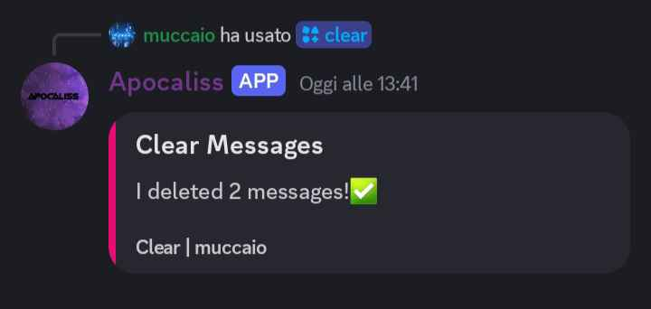

# 🤖 Apocaliss - Discord Bot

  

**Apocaliss** è il bot definitivo per gestire, personalizzare e animare la tua community Discord. Potente, versatile e gratuito. Offri ai tuoi membri un'esperienza superiore grazie a moderazione avanzata, giochi e automazioni su misura.

## 🌐 Sito Web

🔗 [Visita il sito ufficiale](https://tuosito.github.io)  
🎮 [Invita Apocaliss sul tuo server](https://discord.com/oauth2/authorize?client_id=1039915454489170032&scope=bot%20applications.commands&permissions=2146958847)

---

## ⚙️ Funzionalità Principali

- 🔒 **Moderazione avanzata**: ban, kick, mute e automoderazione intelligente.
- 🎉 **Giochi e divertimento**: mini-giochi integrati per coinvolgere la community.
- 🛠️ **Completamente personalizzabile**: prefissi, ruoli, automazioni e molto altro.
- 🌐 **Multilingua (IT/EN)**: cambia lingua facilmente direttamente dal sito.
- 🌓 **Tema chiaro e scuro**: interfaccia adattabile ai tuoi gusti.
- 🖼️ **Pannello visivo dei comandi**: schermate illustrative dei principali comandi (`clear`, `help`, `math`, `member`, `ticket`).
- 💬 **Testimonianze reali**: utenti soddisfatti che confermano l’efficacia del bot.

---

## 📷 Screenshot

| Clear | Help | Math | Member | Ticket |
|:-----:|:----:|:----:|:------:|:------:|
|  |  |  |  |  |

---

## ❓ FAQ

- **Come aggiungo Apocaliss al mio server?**  
  ➤ Clicca su [Invita Ora](https://discord.com/oauth2/authorize?client_id=1039915454489170032&scope=bot%20applications.commands&permissions=2146958847).

- **Il bot è gratuito?**  
  ✅ Sì, completamente gratuito!

---

## 📧 Contatti e Supporto

Hai bisogno di aiuto, suggerimenti o vuoi collaborare?

- 📬 Compila il modulo nella sezione *Contatti* del sito.
- 🛠️ Entra nel [Server di Supporto Discord](https://discord.com/invite/zGUR2wtWSQ)
- ✨ Creato da [Tempestosoh](https://tempestosoh.github.io/portfolio/homepage.html)

---

## 📌 Note

- Il sito è **responsive** e supporta **tema chiaro/scuro**.
- Disponibile in **italiano** e **inglese** tramite toggle dinamico.
- Stato bot in tempo reale: `🟢 Online` visualizzato direttamente in homepage.
